# **Графік нарядів ВЧ V2.0.0**

## Author

- **Denys Yorsh** — *Lead Developer*
- **Gemini (Google AI)** — *AI Pair Programming & Architecture Assistant*

## Technologies used:

- **C++20** (Core logic)
- **Qt 6 Framework** (Qt Quick / QML engine)
- **Бібліотека QXlsx** (Excel export)
- **SQLite database** (Local storage)

---

### Screenshots

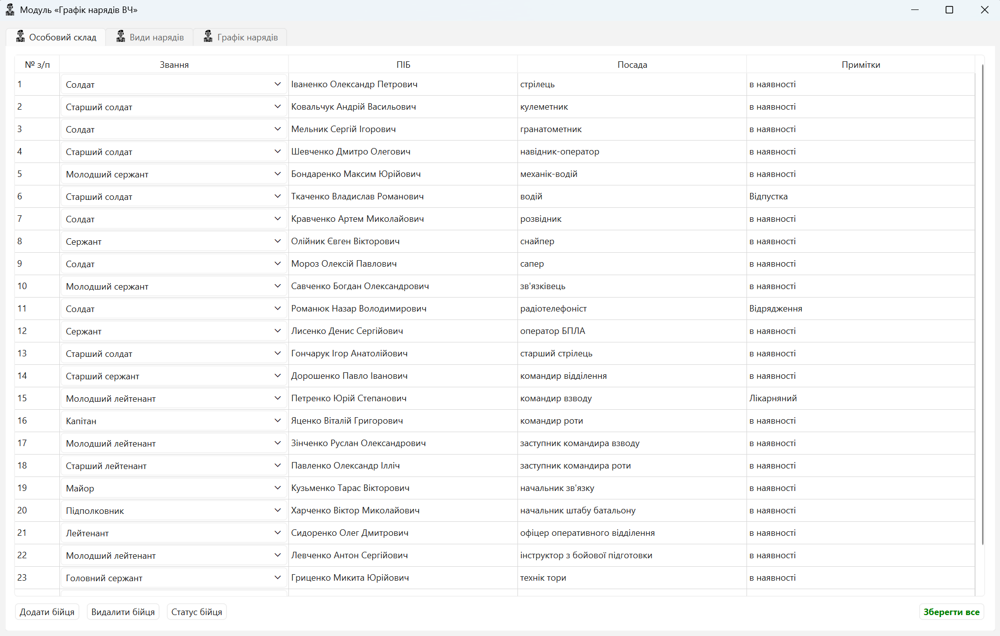

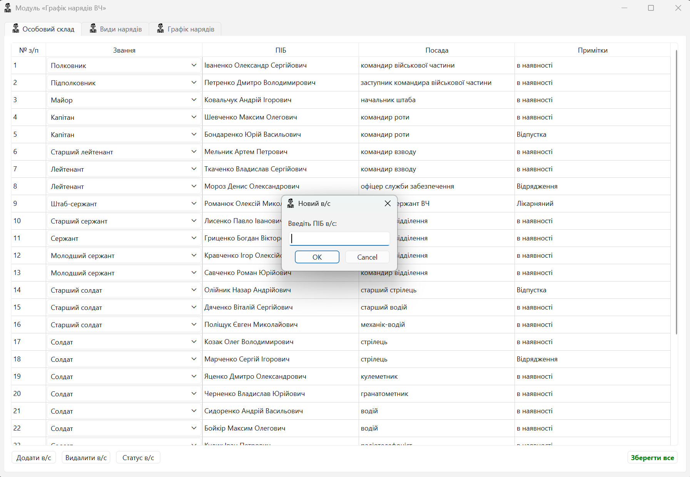

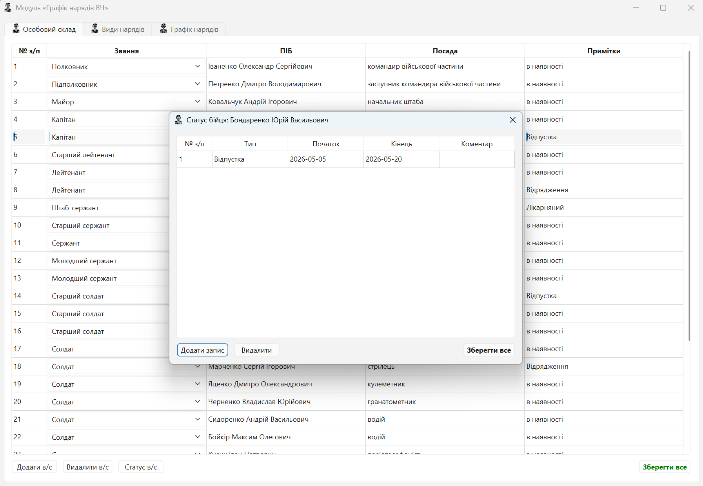

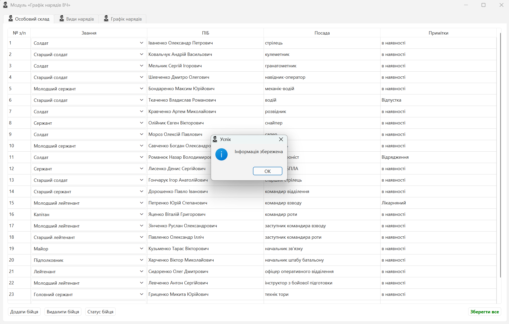

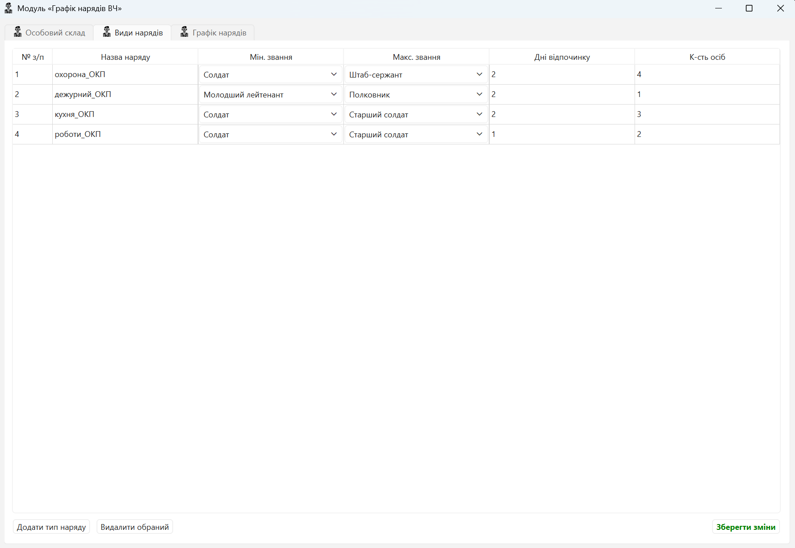

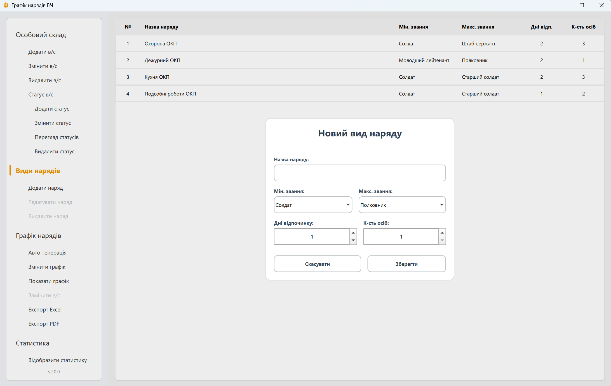

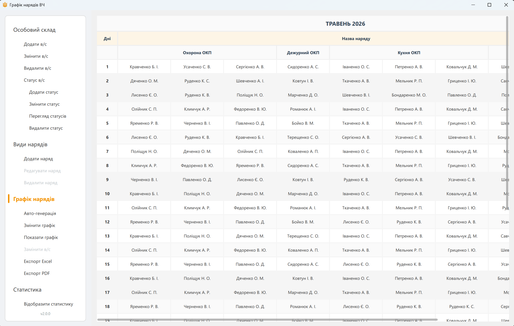

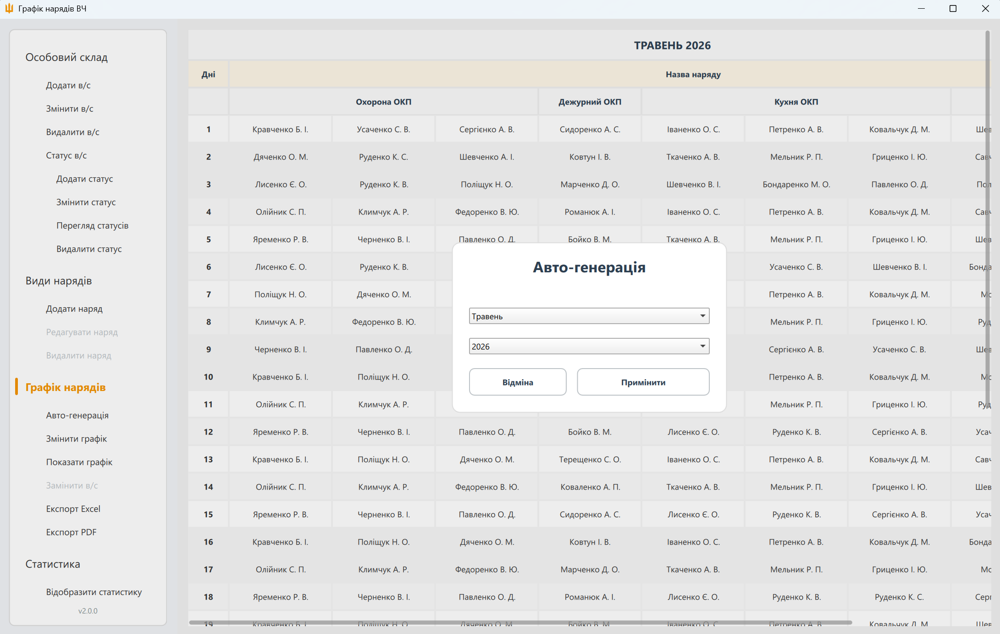

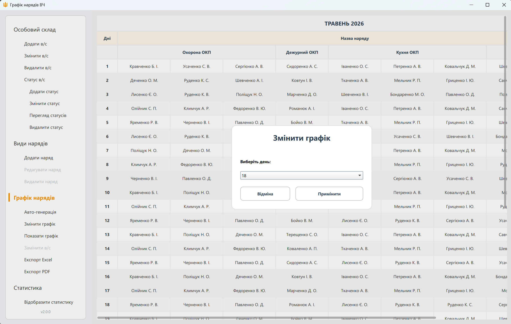

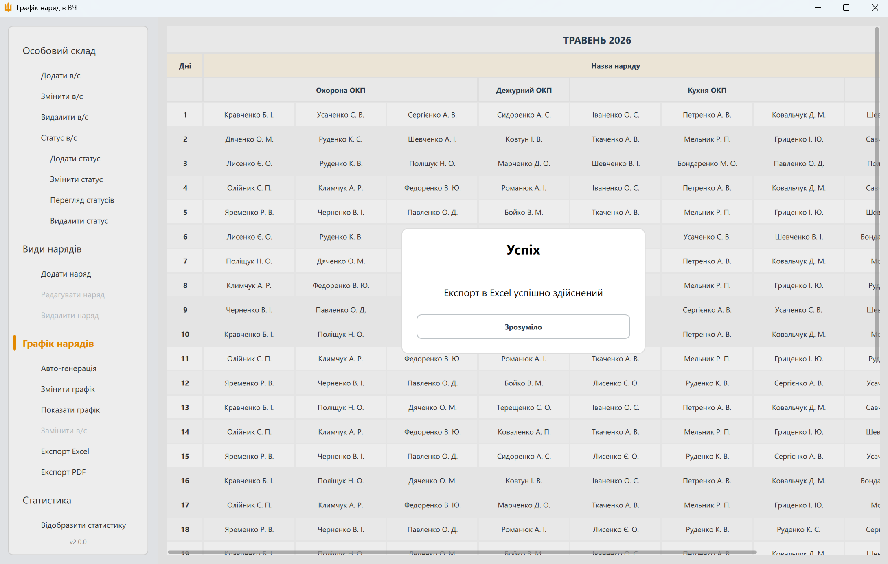

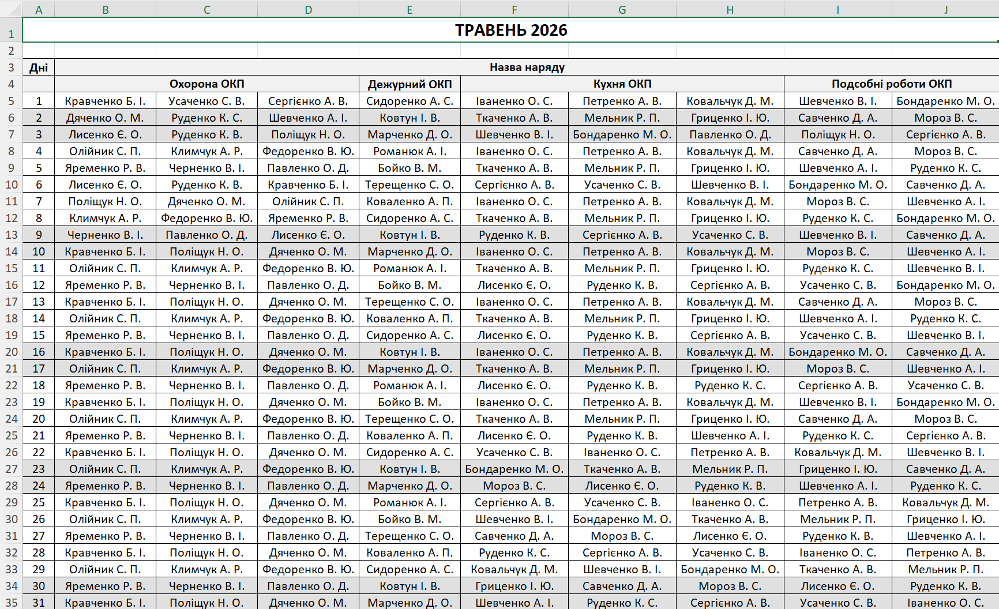

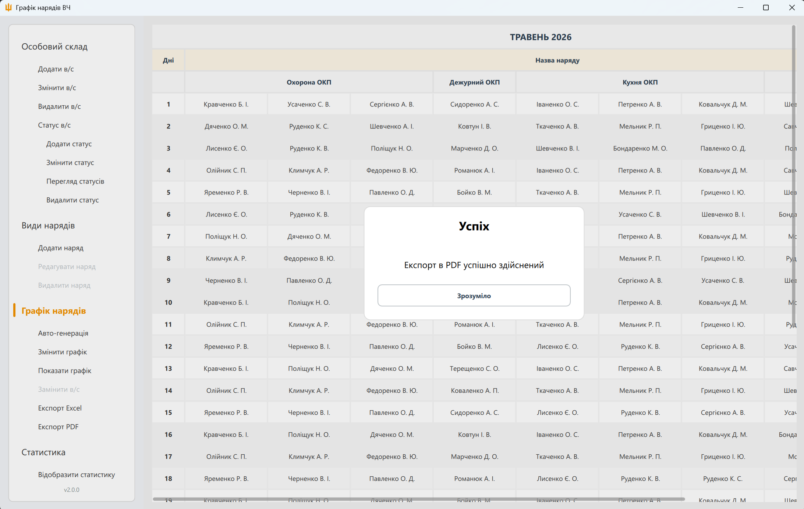

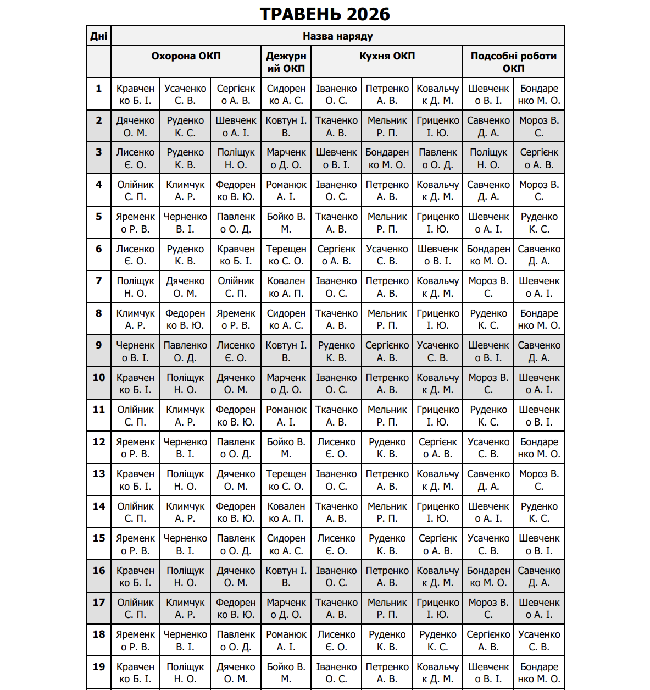

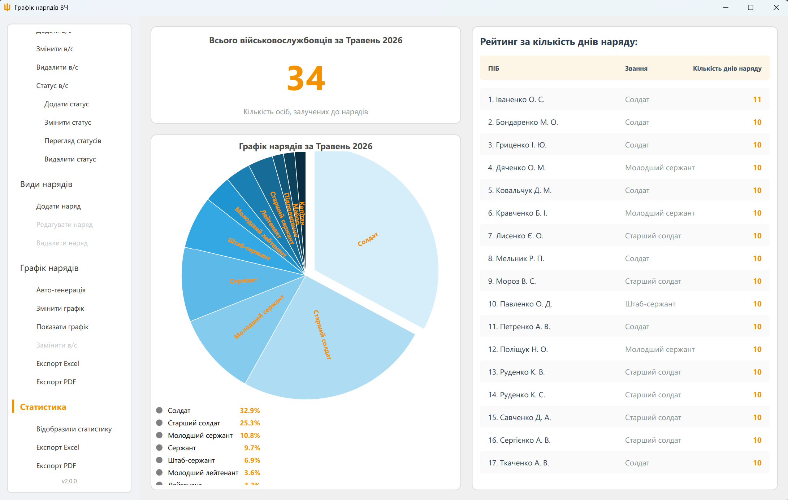

---

### Інструкція зі встановлення та збирання програми «Графік нарядів ВЧ V2.0.0

  Цей проект базується на мові C++, фреймворку Qt 6 та базі даних SQLite.

  1. Підготовка середовища (Встановлення інструментів)

  Оскільки програма використовує графічний інтерфейс Qt, вам потрібно встановити
  відповідний набір інструментів:

   1. Завантажте Qt Online Installer:
       * Перейдіть на офіційний сайт Qt (https://www.qt.io/development/download-open-source).
       * Завантажте та запустіть інсталятор
       * потрібно буде створити безкоштовний обліковий запис Qt (https://login.qt.io/register).
   2. Вибір компонентів при встановленні:
       * Виберіть версію Qt 6.5 (або новішу).
       * Обов'язково позначте компоненти:
           * MSVC 2019/2022 64-bit (якщо у вас встановлено Visual Studio) АБО MinGW 11.2.0 64-bit.
           * Qt Shader Tools.
           * Qt 5 Compatibility Module (про всяк випадок).
       * У розділі "Developer Tools" переконайтеся, що вибрано CMake та Ninja.
   3. Встановлення компілятора:
       * Якщо ви вибрали MSVC, у вас повинна бути встановлена Visual Studio 2022
         (з галочкою "Розробка класичних програм на C++").

  2. Налаштування проекту

   1. Відкрийте Qt Creator (йде у комплекті з Qt).
   2. Виберіть File -> Open File or Project.
   3. Перейдіть до папки D:\duty-manager та виберіть файл CMakeLists.txt.
   4. На екрані "Configure Project" виберіть свій "Kit" (наприклад, Desktop Qt 6.5.x
      MSVC2022 64bit) і натисніть Configure Project.

  3. Збирання та запуск

   1. Збирання: Натисніть на іконку "Молотка" (Build) у нижньому лівому куті.
   2. Запуск: Після успішного збирання натисніть на зелений трикутник (Run).
   3. При першому запуску програма автоматично створить файл бази даних duty_manager.db
      у папці збірки та ініціалізує всі таблиці.

  4. Створення готового .exe файлу

  Щоб програма запускалася на іншому комп'ютері без встановленого Qt, виконайте наступне:

   1. Переключіть режим збірки з Debug на Release у Qt Creator (ліва панель).
   2. Зберіть проект заново.
   3. Знайдіть файл DutyManager.exe у папці збірки (зазвичай це build-DutyManager-Release).
   4. Скопіюйте DutyManager.exe в окрему нову папку.
   5. Відкрийте термінал (PowerShell) та скористайтеся утилітою windeployqt6, яка
      автоматично збере всі необхідні DLL:
      C:\Qt\6.11.x\mingw_64\bin\windeployqt6.exe --qmldir
      D:\duty-manager-app\duty-manager-source-files\qml
      D:\путь_до_вашої_папки\DutyManager.exe
   6. Тепер цю папку можна переносити на будь-який ПК.

  5. Робота з базою даних (SQLite)

   * Всі дані зберігаються у файлі duty_manager.db.
   * Для перегляду бази даних вручну (якщо знадобиться) рекомендую програму DB Browser
      for SQLite.

  ---

  Примітка: Програма повністю автономна і працює без інтернету, що відповідає вимогам
            безпеки військової частини.

---

## Thank you for your attention!
